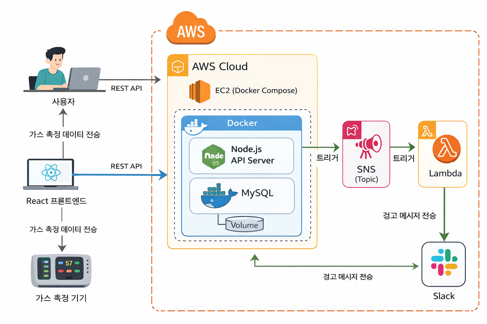
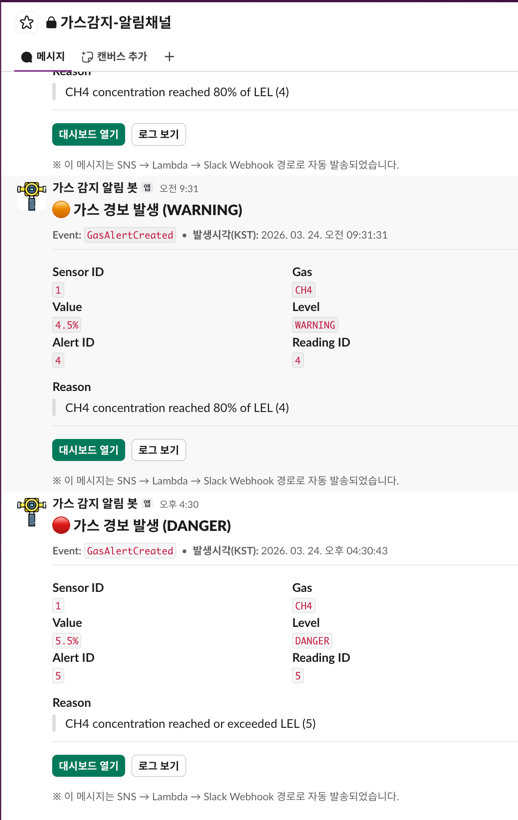
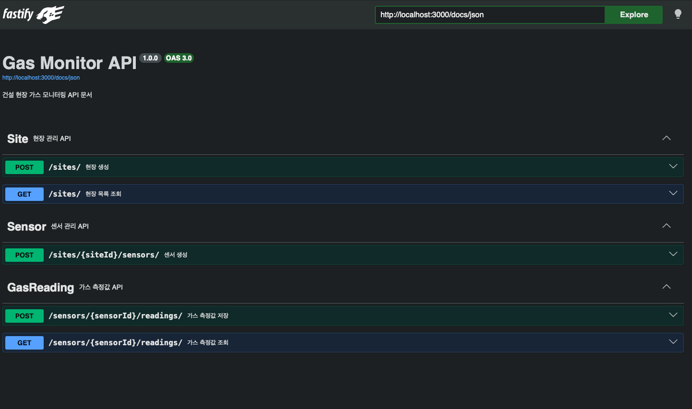
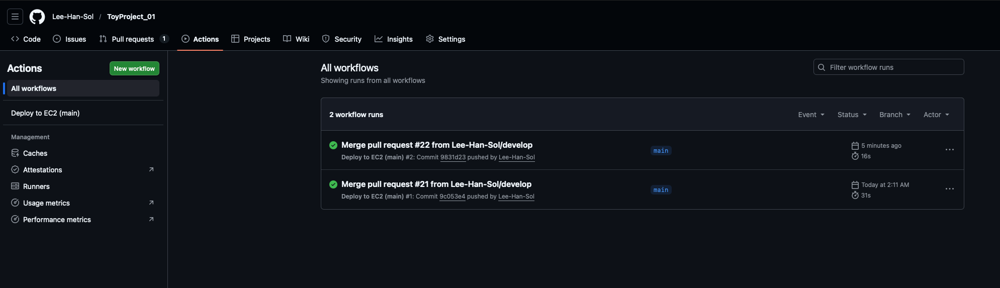
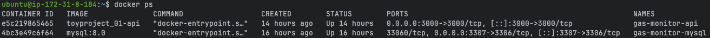

# Gas Monitor Alert System (EDA + Outbox + IaC + CI/CD)

> 가스 측정기기에서 측정값이 들어오면 REST API로 저장하고, 위험 이벤트를 비동기로 발행하여 **SNS → Lambda → Slack** 알림까지 자동 전파하는 백엔드 시스템입니다.  
> 인프라는 Terraform(IaC)로 구성하고, EC2 + Docker + GitHub Actions로 자동 배포합니다.

- 기간: 26.03 ~ (POC 완료 / 리팩토링 단계)
- 작성자: HanSol Lee

---

## 목차
- [프로젝트 개요](#프로젝트-개요)
- [시스템 아키텍처](#시스템-아키텍처)
- [주요 기능](#주요-기능)
- [기술 스택](#기술-스택)
- [디렉토리 구조](#디렉토리-구조)
- [Quick Start (Local)](#quick-start-local)
- [Deploy (EC2 + Docker)](#deploy-ec2--docker)
- [IaC (Terraform)](#iac-terraform)
- [CI/CD (GitHub Actions)](#cicd-github-actions)
- [Troubleshooting](#troubleshooting)
- [추가 고려사항](#추가-고려사항)
- [스크린샷](#스크린샷)
- [면접용 1페이지 요약](#면접용-1페이지-요약)

---

## 프로젝트 개요

### 목표
1) 가스 측정기기에서 측정값 수신 → `gas-reading create` REST API 호출 → DB 저장
2) 위험도 판정 결과를 **Outbox 패턴**으로 안정적으로 이벤트화
3) 이벤트를 **AWS SNS**로 발행하고 **AWS Lambda**가 구독하여 **Slack**으로 알림 전송
4) 인프라를 Terraform으로 코드화하고, EC2 + Docker + GitHub Actions로 자동 배포
5) (운영 기준) EC2는 **IAM Role**로 SNS publish 권한을 위임해 AccessKey를 서버에 두지 않음

### 핵심 포인트
- **저장(동기)** 과 **알림(비동기)** 분리
- **Outbox**로 정합성/재시도 기반 마련
- **SNS**로 fan-out 확장 가능한 이벤트 허브 구성
- EC2는 **IAM Role(Instance Profile)** 기반으로 AWS 키 없이 SNS publish
- Terraform(IaC) + Actions(CI/CD)로 재현/운영 자동화

---

## 시스템 아키텍처

### 흐름
1. Gas Device(측정기기) → Trigger 발생
2. Backend REST API: `POST /gas-readings`
3. MySQL 저장 + 위험도 판정
4. (필요 시) `GasAlert` + `OutboxEvent(PENDING)` 저장
5. OutboxPublisher → SNS Publish
6. SNS → Lambda Trigger → Slack Webhook 알림

### 아키텍처 다이어그램

---

## 주요 기능
- Site / Sensor / GasReading 생성 및 조회
- GasReading 생성 시 위험도 판정(NORMAL/WARNING/DANGER)
- Outbox 패턴 기반 이벤트 발행
  - 트랜잭션 내 `OutboxEvent(PENDING)` 생성
  - Publisher가 PENDING 이벤트를 SNS로 publish 후 SENT/FAILED로 상태 전이
- AWS SNS → AWS Lambda → Slack 알림(Blocks 기반 메시지)
- Swagger(OpenAPI) 기반 API 문서(테스트용)
- Terraform으로 SNS/Lambda/Subscription/IAM Role 구성
- EC2 + Docker Compose로 API/MySQL 구동
- GitHub Actions: main merge 시 자동 배포

---

## 기술 스택
- Backend: Node.js, TypeScript, Fastify
- ORM/DB: TypeORM, MySQL (Docker)
- EDA: Outbox Pattern, AWS SNS
- Notification: AWS Lambda, Slack Incoming Webhook
- IaC: Terraform
- Deploy: EC2, Docker, Docker Compose
- CI/CD: GitHub Actions
- Docs: Swagger(OpenAPI)
- Test: Vitest

---

## Quick Start (Local)

> 로컬은 “빠른 검증” 목적입니다.  
> 최종 운영 형태는 **EC2에서 애플리케이션 + MySQL 둘 다 Docker로 구동**합니다.

### 1) Docker Compose 실행
```
docker compose up -d --build
```
- (권장) 로컬에서는 `docker-compose.yml`로 API+DB까지 같이 올려도 됨
- 만약 로컬에서 앱을 Node로 실행하고 DB만 Docker로 띄우려면, DB만 up 하도록 compose를 분리하거나 서비스 지정 실행

### 2) 환경변수(.env) 설정
로컬에서 “DB만 Docker”로 띄우는 경우 예시:
- DB_HOST: localhost
- DB_PORT: 3307 (호스트 포트가 3307로 열려있는 경우)

운영/도커 내부 통신의 경우 예시:
- DB_HOST: mysql
- DB_PORT: 3306 (컨테이너 내부 포트)

```
.env 예시(로컬/운영 공통 형태로 통일 권장)`
DB_HOST=localhost 또는 mysql
DB_PORT=3307 또는 3306
DB_USERNAME=root
DB_PASSWORD=root
DB_DATABASE=gas_monitor
PORT=3000
AWS_REGION=ap-northeast-2
AWS_SNS_TOPIC_ARN=Terraform apply로 생성된 Topic ARN

#만약 로컬로 진행시 aws 활성키, 비밀키 포함하여 sns publisher에게 credential 입력주어야함
```

※ 변수명은 반드시 앱 코드(TypeORM data-source)가 읽는 키와 동일해야 함

### 3) 로컬 실행(선택)
- 로컬에서 앱을 Node로 실행하려면:

```
cd gas-monitor-service
npm install
npm run dev
```

### 4) Health Check
```
curl http://localhost:3000/health
```

---

## Deploy (EC2 + Docker)

> 최종 운영 형태: **EC2에 애플리케이션 + MySQL 모두 Docker로 구동**

### 1) IaC 먼저 적용(Terraform apply)
Terraform 실행 계정(terraform-user)로 아래 리소스를 생성:
- SNS Topic
- Lambda(슬랙 알림)
- SNS Subscription(Topic → Lambda)
- Lambda Permission
- IAM Role(EC2 Instance Profile, sns:Publish 포함)

```
terraform plan / terraform apply
```
(infra/terraform 디렉토리에서 실행)
- Slack webhook 등 민감값은 `secrets.auto.tfvars`로 주입(커밋 금지)
- apply 후 output에서 SNS Topic ARN을 확인하여 운영 .env에 반영

### 2) EC2 준비
- Ubuntu 24.04 LTS
- Security Group:
  - 22(SSH): 내 IP만
  - 3000(API): 테스트용이면 내 IP만(운영은 80/443 권장)
- IAM Instance Profile(Role) 부착:
  - `sns:Publish` 최소 권한
  - Resource는 실제 Topic ARN으로 제한

### 3) EC2에 Docker 설치 및 실행
- Docker Engine + docker compose plugin 설치
- 프로젝트 경로 예시: `~/app/ToyProject_01`

```
sudo docker compose up -d --build
```

### 4) 운영 환경변수(.env)
운영(EC2)에서는 **IAM Role**을 사용하므로 원칙적으로 아래는 넣지 않음:
- AWS_ACCESS_KEY_ID
- AWS_SECRET_ACCESS_KEY
- AWS_SESSION_TOKEN

운영 필수 값:
- AWS_REGION
- AWS_SNS_TOPIC_ARN
- DB_HOST=mysql
- DB_PORT=3306

---

## IaC (Terraform)

Terraform으로 아래 리소스를 구성:
- SNS Topic
- Lambda Function (Slack Notifier)
- SNS → Lambda Subscription
- Lambda Permission
- IAM Role (Lambda Basic Execution)
- IAM Role + Instance Profile (EC2용 sns:Publish)

민감값 관리:
- Slack Webhook은 `secrets.auto.tfvars`로 관리
- terraform state/tfvars/.terraform/.build 등은 gitignore

---

## CI/CD (GitHub Actions)

현재 구성: **main 브랜치 merge 시 자동 배포**

동작 방식(예시):
1) GitHub Actions가 EC2에 SSH 접속
2) EC2에서 main 최신 코드로 reset
3) `docker compose up -d --build` 실행

“언제 배포되었는지” 확인 방법:
- GitHub → Actions 탭 → 해당 workflow 실행 기록(시간/성공 여부)
- EC2에서 컨테이너 시작 시간 확인

```
sudo docker inspect gas-monitor-api --format 'StartedAt={{.State.StartedAt}}'
```

---

## Troubleshooting

### 1) Docker 데몬 연결 실패
증상: Cannot connect to the Docker daemon  
조치:
```
sudo systemctl enable --now docker.socket
sudo systemctl start docker
sudo systemctl status docker docker.socket --no-pager
```

### 2) API ↔ MySQL 연결 실패
원인/해결 핵심:
- 컨테이너 내부 통신은 `mysql:3306`
- 호스트 포트(3307)는 “외부/호스트에서 접속”할 때만 사용
- `.env`의 키 이름(DB_USERNAME/DB_DATABASE 등)이 코드와 불일치하면 연결 실패

`.env 권장 예시(운영)`
- DB_HOST=mysql
- DB_PORT=3306
- DB_USERNAME=root
- DB_PASSWORD=root
- DB_DATABASE=gas_monitor

### 3) EC2 Role 사용 시 SNS publish 실패
- 서버에 AWS 키를 넣으면 SDK가 환경변수를 우선 사용 → Role이 무시될 수 있음
- 운영에서는 `credentials` 강제 주입 제거 + `.env`의 AWS_ACCESS_KEY/SECRET 제거 권장
- IMDSv2 Required이면 토큰 방식으로 Role 부착 여부 확인

### 4) Dockerfile 빌드 오류: no build stage
- Dockerfile 첫 줄은 반드시 FROM으로 시작해야 함(LABEL이 위에 오면 실패)

---

## 추가 고려사항
- Outbox polling 주기 조절(부하/지연 트레이드오프)
- 중복 이벤트 방지(Idempotency key), 재시도 백오프/Dead-letter 전략
- 운영 확장 시 DB 분리(RDS), 메시징 SQS/EventBridge 고려
- 로그 로테이션/디스크 사용량 관리
- 외부 공개 시 Nginx + 80/443 + TLS 구성
- 시간 표기: 서버/컨테이너는 UTC 유지 + 표출 단계에서 KST 변환(또는 Slack 타임스탬프 문법 활용)

---

## 스크린샷
### Slack 알림 봇 활성

### Swagger Open API

### GitHub Action

### Doker ps

---